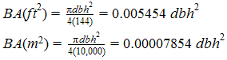

#### Tree Diameter

##### Diameter at Breast Height (DBH)
  - Average stem diameter outside of bark, at 4.5ft (1.3m) above the ground, from the uphill side of stem
  - Measurements usually made with diameter tape, tree caliper, or Biltmore stick.
  - Instruments used for determining tree diameters are referred to as dendrometers

##### Dendrometer Comparison

1. Diameter Tape
  - Nearest 0.1 inch
  - Most consistent method of measuring DBH, though irregular trees are likely to be positively biased.
2. Tree Caliper
  - Nearest 0.1 inch (if care is taken)
  - Directional bias minimized by measuring all diameters from the tree face closest to plot center. If stem cross sections are decidedly elliptical, two readings perpendicular to each other should be made and the average recorded.
3. Biltmore Stick
  - Nearest full inch
  - DBH graduation =  where A=distance to eye, D=diameter of tree, A usually 25in.
  - Because of difficulty maintaining consistent distance to eye, the Biltmore stick must be regarded as a crude measuring device. Accuracy tends to decrease with larger dbh due to shortened intervals between inch gradations.

##### Irregular Tree Rules

1. **Slope**: Measure on uphill side
2. **Swellings, bumps, depressions, or branches**: Measure just above the irregularity at a point where it ceases to affect stem form
3. **Fork immediately above DBH**: Measure below the swell resulting from the double stem
4. **Fork below DBH**: Each stem considered separate tree and diameters measured approximately 3.5ft (1.07m)  above fork
5. **Swell-butted species (Cypress, tupelo gum, etc)**: Swell-butted species (Cypress, tupelo gum, etc)
6. **Snow / Flooded Area**: Use pole to probe true ground level

##### Diameter Classes

If using 1in diameter classes it is customary to drop back to the lower value when diameters fall exactly halfway between inch gradations, i.e., round down. Example: 8in class limits are 7.6 to 8.5 inches. For two inch classes: 8in class limits are 7.1 to 9 inches.

 

#### Basal Area

Basal area is the cross-sectional area at breast height

 

#### Tree Height

Height is measured with instruments called hypsometers. Two common hypsometers are:

1. Clinometer
  - For accurate results, trees must not lean more than 5° from the vertical, and the fixed horizontal distance must be determined by taped measurement or careful pacing.
  - Measurements within 2 to 5 percent of true heights
  - Leaning trees should be measured at right angles to the direction of lean to minimize height errors.
  - Tree height is derived by taking the difference between the two readings, i.e., the base and top of the tree.
2. Merritt Hypsometer
  - Usually used to determine merchantable logs rather than total heights.
  - Gradations are placed at 16-ft log or 8-ft half-log intervals.
  - Hypsometer stick positioned at a fixed distance from the eye and the observer must stand a specified distance from the tree.
  - Lower end of stick on a line of sight to the tree stump.
  - Merchantable height: the usable portion of the tree stem, i.e., the portion than can be utilized in a commercial logging operation
  - Upper limits of stem merchantability may be chosen as a percentage of dbh. Example: 60% for small trees, 50% for medium trees, and 40% for large diameter trees

 

#### Plot Sampling - Variable Radius Plots

BAF = Basal Area Factor

BAF of 10 sq ft per acre (BAF 10) is commonly used in second-growth sawtimber stands or dense poletimber stands.
BAFs of 5 and 20 are employed for light-density pole stands and for large, old-growth sawtimber respectively.

Two common tools for measuring variable radius plots are:

1. Stick-Type Angle Gauge
  - Eye directly over sample point
  - BAF 10 has a ratio (tree diam to plot radius) of 1:33, so a 33 inch stick with a 1 inch horizontal intercept is can be used
  - Borderline trees: must be within _dbh * 2.75_ feet of plot center (for BAF 10)
2. Wedge Prism
  - Hold prism precisely over sample point, not observer’s eye
  - Borderline trees should be measured
  - Corrections must be applied when measuring slopes 15 percent or greater

  

---

 

##### Reference: 

*Avery and Burkhart. Forest Measurements. Fifth Edition. McGraw-Hill 2002. Chapters 7 and 11.*
